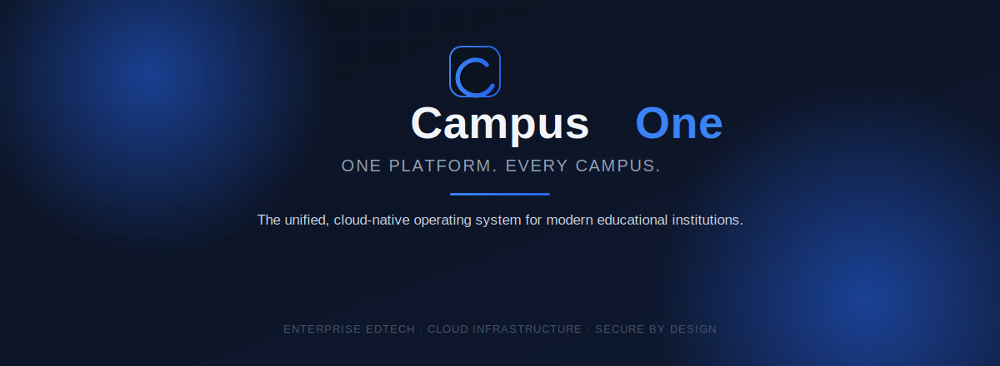
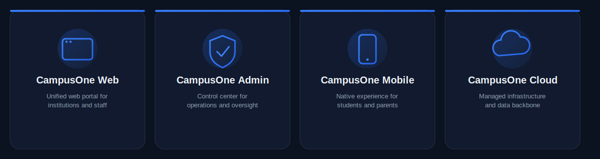
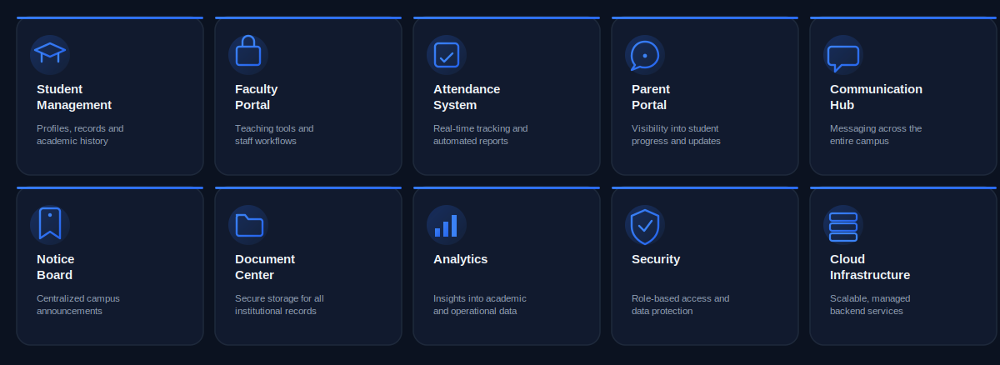
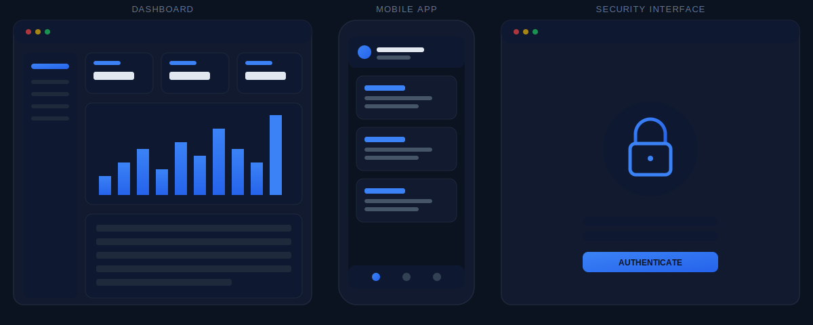
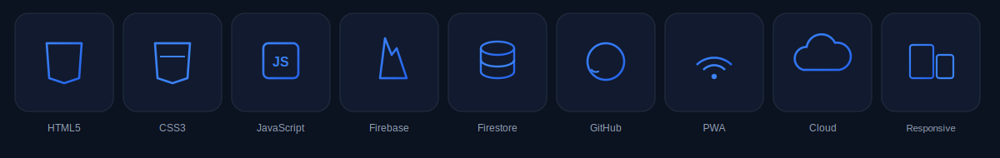
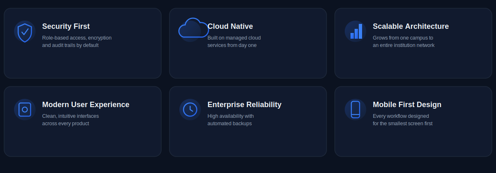
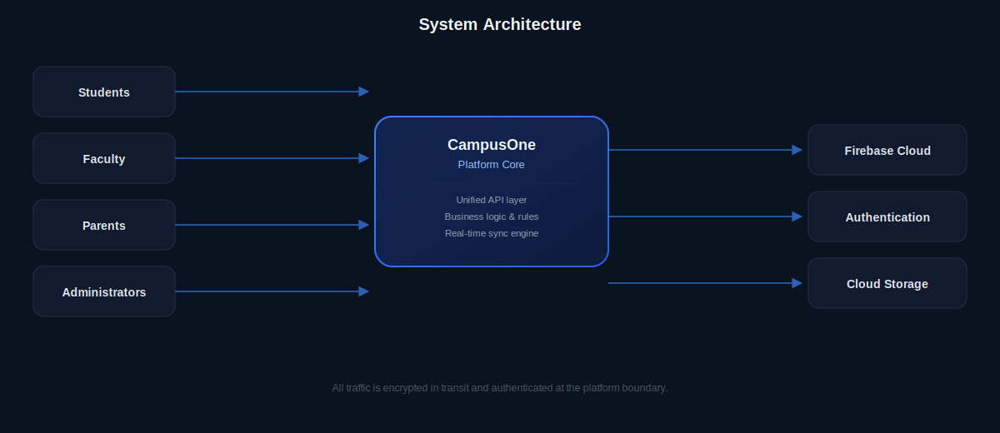
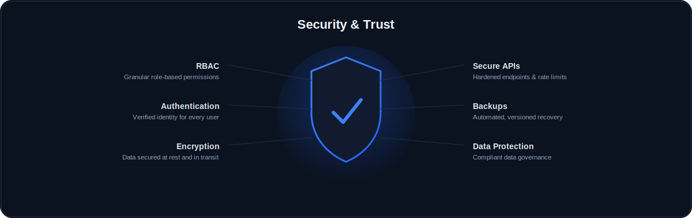
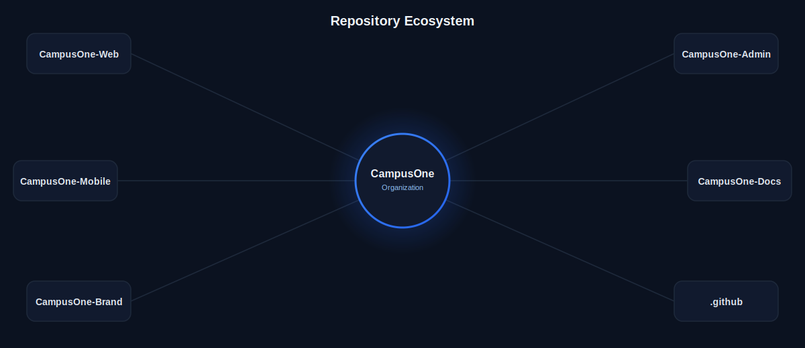
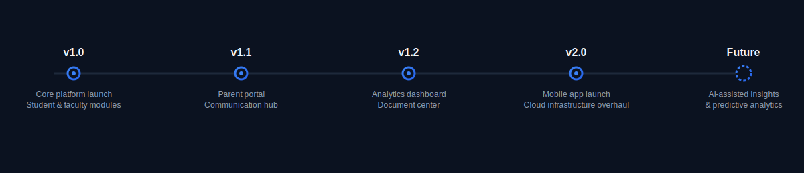

 

 

### Building the operating system for modern education

CampusOne unifies students, faculty, parents, and administrators inside a single secure
platform — replacing fragmented spreadsheets and disconnected tools with one connected,
cloud-native system built for how campuses actually run.

 

---

 

 

## Platform Modules

 

---

 

## Product Showcase

 
Interface mockups shown for illustration — replace with live product screenshots before publishing.

 

---

 

## Technology Stack

 

---

 

## Why CampusOne

 

---

 

## System Architecture

 

---

 

## Security &amp; Trust

 

---

 

## Engineering

<table>
<tr>
<td width="50%" valign="top">

**Repository Structure**
Each product ships from its own repository with isolated CI/CD, versioning, and release cadence — keeping web, admin, mobile, and infrastructure changes independent and auditable.

**Development Workflow**
Trunk-based development with protected `main` branches, mandatory pull request review, and automated checks before merge.

</td>
<td width="50%" valign="top">

**Coding Standards**
Shared lint and formatting configs, consistent commit conventions, and documented style guides across every repository.

**Modular Architecture**
Each platform module — attendance, communication, analytics, and more — is built as an independently testable unit composed into the platform core.

</td>
</tr>
</table>

 

## Repository Ecosystem

 

---

 

## Roadmap

 

---

 

## Documentation &amp; Community

<table>
<tr>
<td width="33%" valign="top">

**Contributing**
Read the [contribution guide](https://github.com/buildcampusone/.github/blob/main/CONTRIBUTING.md) before opening a pull request.

</td>
<td width="33%" valign="top">

**Documentation**
Full platform and API docs live in [CampusOne-Docs](https://github.com/buildcampusone/CampusOne-Docs).

</td>
<td width="33%" valign="top">

**Discussions &amp; Support**
Ask questions in [Discussions](https://github.com/orgs/buildcampusone/discussions) or open an [issue](https://github.com/buildcampusone/.github/issues) for bugs and feature requests.

</td>
</tr>
</table>

 

---

 

**CampusOne**
*One Platform. Every Campus.*

[Website](https://campusone.com) · [GitHub](https://github.com/buildcampusone) · [LinkedIn](https://linkedin.com/buildcampusone) · [Email](mailto:hello@campusone.com)

© 2026 CampusOne. All rights reserved.

